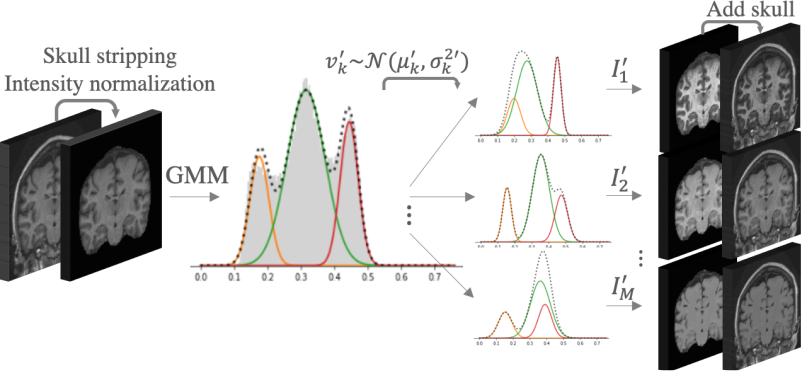
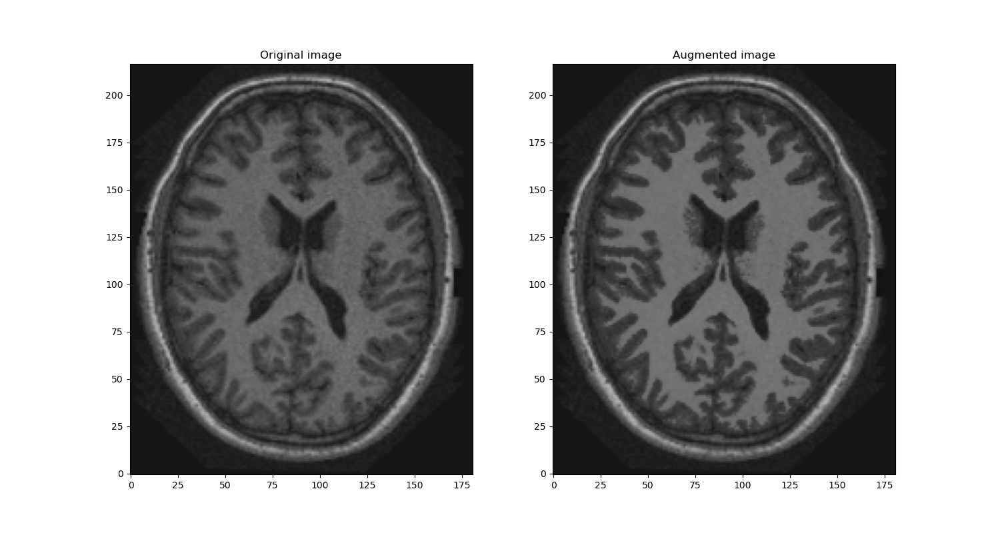

# An augmentation strategy to mimic multi-scanner variability in MRI

Implementation of a data augmentation (DA) approach with the aim of reducing the scanner bias of models trained on 
single-scanner data. This method was submitted to the ISBI 2021 conference, and is pending review. 

> Meyer M.I. , de la Rosa E., Pedrosa de Barros N., Paolella R., Van Leemput K. , Sima D.M.. 
> An augmentation strategy to mimic multi-scanner variability in MRI


Method
------------
The method aims to increase the intensity and contrast variability of a single-scanner dataset such that it is representative of the variability found in a large multi-scanner cohort. To do this we randomly modify the MRI tissue intensities using a Gaussian Mixture Model based approach. As a result the contrast between tissues varies, as seen when different scanners are used at acquisition.



Requirements 
------------
The following packages are necessary to run the code:
- python>3.5
- numpy
- scikit-learn=0.23
- nibabel=3.2

Applying the method to a single image
------------------------
The method is exemplified in the `demo.py` script. To run this you will need a T1 image and the corresponding brain
 mask in nifti format (nii.gz). We do not provide images to test the model on, the example results we show were
  acquired on the publicly available OASIS dataset.
  You can run this using all the default options by simply doing  

```
python demo.py -i <path to T1> -m <path to mask>
```
Optional arguments include:
```
 -n number of components in the mixture
 -mu range of variability to change the mean of each component in the mixture. 
 -s range of variability to change the standard deviation of each component in the mixture.
 -p percentiles to use when clipping the intensities. Default (1,99).

```
This script saves an image to a `results/` folder, which will be created automatically if it does not exist.



##### NOTE:

The method performs better if images have been bias-field corrected, but this is not strictly necessary.
When exploring the methos it is possible to set a fixed variation term for each of the components (see 
function generate_gmm_image() in augmentation_utils.py).


---------------------------------- 

 
--------
    
### References
1.  Marcus, DS, Wang, TH, Parker, J, Csernansky, JG, Morris, JC, Buckner, RL. 
*Open Access Series of Imaging Studies (OASIS): Cross-Sectional MRI Data in Young, Middle Aged, Nondemented, and Demented Older Adults*
Journal of Cognitive Neuroscience, 19, 1498-1507. doi: 10.1162/jocn.2007.19.9.1498
